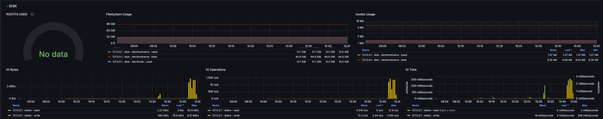
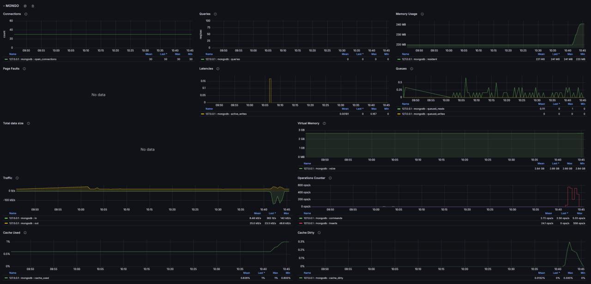

# hsa-tig-load
HSA homework 1

## How to start
1. Clone the repo to local machine
2. Head to `./server` on local machine and run `npm install` (required once to create node_modules folder before it will be projected to inner docker container filesystem)
3. Head to root of the cloned repo
4. Run `docker-compose up -d`
5. Enter into the console of the `hsa_12_server` container
   1. run `npx typeorm-ts-node-commonjs migration:run -d ./src/database/config/ormconfig.ts`
6. Go to `localhost:4444` 
   1. configure datasource to influx 
   2. import dashboard from `https://grafana.com/grafana/dashboards/8709-tig-metrics/`
7. Install siege (via homebrew/apt get etc)
8. Modify siege config to use custom urls file OR edit default file to contents of `./siege/siege-test.txt`
9. In host machine console run `siege` - this will initiate siege script to process urls given in file mentioned above
10. Go to `localhost:4444` and observe metrics changes

## Alt testing
If siege is not your to-go option just configure your tool of choice to bombard `POST http://localhost:5678/api/v1/unit-1/random` with requests.
This endpoint creates dummy entity with random generated id (UUIDv4) and store it to postgres, mongo and make an index of created model in elasticsearch/

## Proofs
1. CPU / RAM / SWAP
 
2. Disk 
3. Nginx 
4. Mongo  
5. Postgres 
6. Elastic   